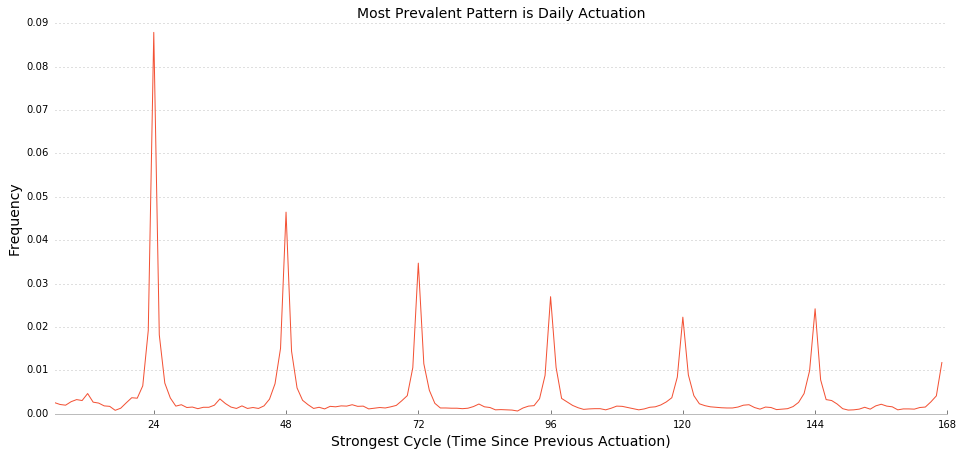

This post seeks to answer the following question:
>Can we identify users who are likely candidates for time rules?

This post examines the population of users who do not use WeMo's scheduling features, yet use their device manually on a schedule. We introduce our methodology for identifying those users, and explore the types of devices they use with their WeMo products based on custom names.


### Key Findings
* Approximately 10-15% of users manually actuate their Switches, Insights, or Lightswitches consistently on a daily cycle.
* Of those users, only 40-45% have ever used time rules to actuate their devices.
* Devices in bedrooms are the most likely to be manually actuated on 24-hour cycles.
* Of devices plugged in to Switches, coffee makers are the most likely to be manually actuated on 24-hour cycles.

### Limitations
In this post, we do not consider a user's full actuation history; rather we take the last 2 weeks of their actuation data such that our findings reflect users' most recent habits. Manual actuations are examined based on hourly counts.


### Identifying Common Actuation Schedules

To determine whether actuation patterns are cyclical, we conduct statistical hypothesis tests to evaluate whether a user's actuations are significantly correlated with previous actuations for a given interval.

For instance, if a user's actuation frequency at 12:00 PM is significantly correlated with their behavior at 5:00 AM, we conclude that the user actuates their device on a 6 hour cycle. If a device is used on both a 6 hour and 12 hour cycle, we simplify by stating the user is on a 6 hour cycle, as the 12 hour cycle is encompassed by the 6 hour cycle.

Below, we plot the strength of correlation in behavior at different time intervals.

The plot below illustrates the average autocorrelation between a user's actuations at a given time and their actuations t hours ago:


We find that there are strong daily cycles of actuation patterns. While there are longer cycles, some cases of having 48 or 72 cycles may simply be artifacts of having a 24 hour cycle. Therefore, for each user with compute the strongest single cyclic pattern. For instance, if a user's 24 hour autocorrelation is .1 and their 48 hour autocorrelation function is .08, then we would determine that the strongest cycle for that user is 24 hours. We plot the frequency of strongest cycles below.


```python
plot_data = acfs[range(1, lag_hours)].T.idxmax().value_counts().loc[range(6, lag_hours)]
plot_data
plot_data = plot_data / sigs.shape[0]
ax = plot_data.plot()
ax.set_xticks([i*24 for i in range(1, 8)])
ax.set_xlabel("Strongest Cycle (Time Since Previous Actuation)")
ax.set_ylabel("Frequency")
ax.set_title("Most Prevalent Pattern is Daily Actuation")
ax.axhline(0, linestyle = ":")
format_chart(plt.gca())
ax.legend_.remove()
plt.show()
```





Our final step is to determine whether each user's strongest cycle is statistically significant (i.e. whether the results are significant enough to not be attributed to random chance). The plot below illustrates the frequency of statistically significant strongest cycles.


```python


def conditional_idxmax(row):
    if pd.isnull(max(row))==True:
        return 'No Sig Cycle'
    elif max(row) == False:
        return 'No Sig Cycle'
    else:
        return np.argmax(row)
```


```python
plot_data = sigs[range(1, lag_hours)].apply(lambda x: conditional_idxmax(x),axis=1).value_counts().sort_index().iloc[5:-1]
plot_data = plot_data / sigs.shape[0]
ax = plot_data.plot()
ax.set_xticks([i*24 for i in range(1, 8)])
format_chart(plt.gca())
ax.legend_.remove()
plt.show()
```


Most of the observed multi-day patterns are either insignificant or are artifacts of daily use, though there are a small number of users that exhibit 2-3 day cycles of usage. Overall, 24-hour cycles are the most common, with 10-15% of users actuating on this schedule.


```python
cycle_data = sigs[range(1, lag_hours)].apply(lambda x: conditional_idxmax(x),axis=1)
mac_addresses_of_daily_users = cycle_data[cycle_data==24].index.values
```

### Users with Daily Cycles

Prevalence of daily manual actuation cycles varies between device types and locations. Bedrooms have the highest percentage of devices that follow 24-hour manual cycles. This is especially pronounced for Insights, as 19% of bedroom insights are actuated on 24-hour cycles. By contrast, outdoor Insights and Switches are the least-often actuated on 24-hour manual cycles, at 6% and 10%, respectively. Interestingly, this does not apply to outdoor Lightswitches; 17% of these devices are actuated on manual 24-hour cycles.


```python
append_data = df.groupby(['mac','modelcode','location'])['date'].count().reset_index().drop('date',1).set_index('mac')
append_data['cycle'] = cycle_data
append_data['has_24_hour_cycle'] = append_data.cycle.apply(lambda x: x in (23,24,25))

```


```python
def name_cleaner(name):
    clean_dict = {'living-room':'Living Room',
                  'other-space':'Other Location',
                  'office':'Office',
                  '':'Unknown Location',
                  'outdoor':'Outdoor',
                  'bedroom':'Bedroom',
                  'kitchen':'Kitchen',
                  'socket':'Switch'}
                  
    if name in clean_dict.keys():
                  return clean_dict[name]
    else: return name
    
```


```python
plot_data = append_data.groupby(['modelcode','location'])['has_24_hour_cycle'].mean().unstack().drop('other-language',1)
order = plot_data.mean().sort_values().index.values
plot_data = plot_data[order]
```


```python
jmdf_2 = plot_data.T * 100
jmdf = jmdf_2.copy()
jmdf.index = jmdf.index.map(name_cleaner)
```


```python
#jmdf = jmdf.unstack().unstack()
jmdf
```


<div>
<table border="1" class="dataframe">
  <thead>
    <tr style="text-align: right;">
      <th>modelcode</th>
      <th>Insight</th>
      <th>Lightswitch</th>
      <th>Socket</th>
    </tr>
  </thead>
  <tbody>
    <tr>
      <th>Office</th>
      <td>6.542056</td>
      <td>15.706806</td>
      <td>10.169492</td>
    </tr>
    <tr>
      <th>Outdoor</th>
      <td>6.153846</td>
      <td>17.289459</td>
      <td>9.629630</td>
    </tr>
    <tr>
      <th>Unknown Location</th>
      <td>12.112542</td>
      <td>16.539440</td>
      <td>12.624357</td>
    </tr>
    <tr>
      <th>Other Location</th>
      <td>12.275449</td>
      <td>14.027630</td>
      <td>15.025907</td>
    </tr>
    <tr>
      <th>Kitchen</th>
      <td>10.243902</td>
      <td>16.306954</td>
      <td>16.666667</td>
    </tr>
    <tr>
      <th>Living Room</th>
      <td>13.712544</td>
      <td>14.117647</td>
      <td>17.427386</td>
    </tr>
    <tr>
      <th>Bedroom</th>
      <td>19.085487</td>
      <td>18.319838</td>
      <td>18.386492</td>
    </tr>
  </tbody>
</table>
</div>


```python
rk.plot(jmdf, kind = 'bar',
        title='Users who Exhibit Strong Daily Manual Actuation Patterns',
        ylabel='Percentage of Devices in Location')
```


        <iframe
            width="100%"
            height="500"
            src="https://viz.datascience.com/id/78972fb73f17726e5c2e2a34493237d0?params=%7B%27kind%27%3A+u%27bar%27%2C+%27id%27%3A+u%2778972fb73f17726e5c2e2a34493237d0%27%2C+%27title%27%3A+u%27Users+who+Exhibit+Strong+Daily+Manual+Actuation+Patterns%27%7D"
            frameborder="0"
            allowfullscreen
        ></iframe>
        


```python
query = """
SELECT location,
       modelcode,
       device,
       actuation_f.macaddress AS mac,
       DATE (datets) AS DATE,
       DATE_PART('hour',datets) AS hour,
       COUNT(1) AS acts
FROM actuation_f
  INNER JOIN ((      SELECT d1.macaddress AS mac,
                     w.modelcode,
                     location,
                     device,
                     MAX(DATE) AS last_usage_date,
                     COUNT(1)
              FROM (SELECT macaddress,
                           DATE (datets) AS DATE,
                           DATE_PART('hour',datets) AS HOUR,
                           COUNT(1) AS acts
                    FROM actuation_f
                    WHERE LOWER (actuatedby) LIKE '%manual%'
                    GROUP BY macaddress,
                             DATE (datets),
                             DATE_PART('hour',datets)) AS d1
                LEFT JOIN wemo_d AS w ON w.macaddress = d1.macaddress
                LEFT JOIN ds_custom_name_annotations AS ds ON ds.wemoid = w.pluginid
              WHERE device <> '' and device <> 'light'
              GROUP BY d1.macaddress,
                       w.modelcode,
                       location,
                       device
                       
                       )
                UNION       
                      (      SELECT d1.macaddress AS mac,
                     w.modelcode,
                     location,
                     device,
                     MAX(DATE) AS last_usage_date,
                     COUNT(1)
              FROM (SELECT macaddress,
                           DATE (datets) AS DATE,
                           DATE_PART('hour',datets) AS HOUR,
                           COUNT(1) AS acts
                    FROM actuation_f
                    WHERE LOWER (actuatedby) LIKE '%manual%'
                    GROUP BY macaddress,
                             DATE (datets),
                             DATE_PART('hour',datets)) AS d1
                LEFT JOIN wemo_d AS w ON w.macaddress = d1.macaddress
                LEFT JOIN ds_custom_name_annotations AS ds ON ds.wemoid = w.pluginid
              WHERE device <> '' and device <> 'light'
              GROUP BY d1.macaddress,
                       w.modelcode,
                       location,
                       device
                       
                       ) 
                       ) AS freq_macs ON freq_macs.mac = actuation_f.macaddress
WHERE lower (actuatedby) LIKE '%manual%'
AND   datediff (days,DATE (datets),DATE ('2016-08-27')) < 14
GROUP BY location,
         modelcode,
         device,
         actuation_f.macaddress,
         DATE (datets),
         DATE_PART('hour',datets)


     
        
"""        
df = pd.read_sql(query, conn)
df = df.sort(['mac','date','hour'], ascending = True)
df['ts'] = df.apply(lambda x: datetime.datetime(x['date'].year, x['date'].month, x['date'].day,int(x['hour'])),axis=1)
```


```python
id_col = 'mac'
ordering_col = 'ts'
event_col = 'acts'
z = explodeDataFrameHours(df, ordering_col, id_col, event_col).reset_index()
```


```python
z['hour'] = z.ts.apply(lambda x: x.hour)
z['hour_number'] = z.groupby('mac').cumcount()
z['last_actuation'] = z.mac != z.mac.shift(-1)
z['first_actuation'] = z.mac != z.mac.shift(1)
z['inactive'] = (z.acts==0).map({True:1, False:0})
z['was_inactive'] = z['inactive'].shift()
z['was_inactive'][z.first_actuation==True] = np.nan
z['periods_ianctive'] = z.apply(lambda x: cond_count(x), axis = 1)
z['hour_number'] = z.groupby('mac').cumcount()
z['period_shift'] = z.inactive != z.was_inactive
z['period_shift'] = z.groupby('mac')['period_shift'].cumsum()
```


```python

```


```python

```


```python
from statsmodels.tsa import stattools

mac_addresses = list(set(z.mac))
acfs = {}
sigs = {}

lag_hours = 24 * 7


for mac in mac_addresses:
    counts = z[z.mac==mac].acts
    if len(counts)>lag_hours:
        acfs[mac], sig = stattools.acf(counts, nlags=lag_hours, alpha = .05)
        sig_level = np.apply_along_axis(lambda x: np.equal(*np.sign(x)) and x[1] > 0, 1, sig)
        sigs[mac] = sig_level
    else:
        acfs[mac] = np.nan
        sigs[mac] = np.nan
acfs = pd.DataFrame(acfs)
acfs = acfs.T
sigs = pd.DataFrame(sigs).T
```


```python
cycle_data = sigs[range(1, lag_hours)].apply(lambda x: conditional_idxmax(x),axis=1)
mac_addresses_of_daily_users = cycle_data[cycle_data==24].index.values

append_data = df.groupby(['mac','modelcode','device'])['date'].count().reset_index().drop('date',1).set_index('mac')
append_data['cycle'] = cycle_data
append_data['has_24_hour_cycle'] = append_data.cycle.apply(lambda x: x in (23,24,25))

```

Percentages of users who actuate manually on 24-hour cycles also differs by the kind of device plugged in to WeMo Switches. Electric blankets and coffee makers are the most commonly actuated on 24-hour cycles, at 18-19% of the time. This is likely due to these devices' place in daily routines, i.e. during sleep and immediately after waking up. Fans, AC units, and heaters are less likely to be actuated on 24-hour cycles, but are more commonly actuated on 10 to 12-hour cycles, possibly corresponding to users' work schedules.


```python
common_devices = append_data.device.value_counts()[append_data.device.value_counts() > 75].index.values
plot_data = append_data.groupby('device')['has_24_hour_cycle'].mean().loc[common_devices].sort_values(ascending = False)
```


```python
final_df = plot_data.copy()
final_df = final_df * 100
final_df
```


    device
    Electric Blanket           18.823529
    Coffee Maker               17.537943
    Kettle                     15.887850
    Water Heater               11.627907
    TV                         10.645724
    Fan                        10.366329
    Heater                      9.931507
    AC                          9.467456
    christmas/outdoor light     9.055338
    Music                       8.620690
    Camera                      4.020101
    Name: has_24_hour_cycle, dtype: float64


```python
rk.plot(final_df,
        title='Switch Users who Exhibit Daily Manual Actuation Patterns',
        xlabel = 'Plugged-in Device',
        ylabel='Percentage of Users with Daily Usage Pattern')
```


        <iframe
            width="100%"
            height="500"
            src="https://viz.datascience.com/id/3de214acec1ef4acf804ae3af1af86b7?params=%7B%27kind%27%3A+u%27barh%27%2C+%27id%27%3A+u%273de214acec1ef4acf804ae3af1af86b7%27%2C+%27title%27%3A+u%27Switch+Users+who+Exhibit+Daily+Manual+Actuation+Patterns%27%7D"
            frameborder="0"
            allowfullscreen
        ></iframe>
        


### Impact and Further Opportunities

This post explored the prevalence of repeated cycles of manual device actuations, with the intent of determining the viability of recommending rules based on these patterns. 24-hour cycles are common, with some device subsets utilizing them up to 19% of the time.

Of the users on 24-hour cycles, only 40-45% have ever used time rules. Because these users are using manual actuations in a pattern that lends itself to time rules, the value they are extracting from their devices could potentially be enhanced by recommending rules. This could be done via enhancements to the app, e.g. implementation of push notifications based on patterns. This analysis is also valuable as a measurement of overall use/disuse of time rules in situations where they would be helpful. Future analyses can examine the viability of recommending other rule types based on behavioral patterns.


```python

```
